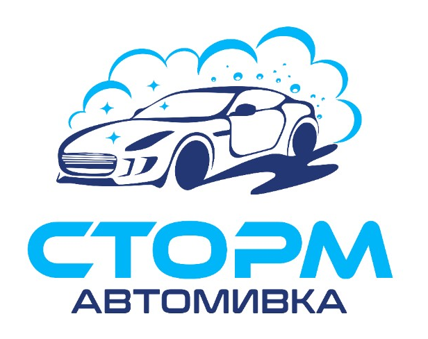

<div align="center">
  <table border="0" cellpadding="28" cellspacing="0">
    <tr>
      <td align="center" bgcolor="#070B14">
        
      </td>
    </tr>
  </table>
</div>

<h1 align="center">STORM / СТОРМ АВТОМИВКА</h1>

<p align="center">
  Official website for a self-service and staffed car wash in <strong>Kazanlak, Bulgaria</strong>.
</p>

<p align="center">
  <code>Bulgarian first</code>
  &nbsp;·&nbsp;
  <code>English second</code>
  &nbsp;·&nbsp;
  <code>one page</code>
  &nbsp;·&nbsp;
  <code>dark automotive</code>
</p>

<p align="center">
  Казанлък · пътят за Овощник, под базата на Кибо 2
</p>

---

## What this is

A compact local-business site for **Автомивка СТОРМ** — not a booking platform, not a blog, not a SaaS template.

Someone landing here should know, in a few seconds:

- what this place is
- where it is
- what the self-service programs cost
- how to get there

The visual language follows the real identity: storm cyan, deep navy, graphite, and photographs of the actual yard.

**Self-service** runs 24 hours. **Staffed bays** are 08:00–17:00. Payment is coins (€0.50 / €1 / €2) or card.

## Stack

| | |
| --- | --- |
| App | Next.js 16 (App Router) + React 19 |
| Language | TypeScript |
| Style | Tailwind CSS 4 |
| Copy | next-intl — `bg` default, `en` at `/en` |
| Motion | Motion (hero + gallery) |
| Runtime | Node **24+** |

## Run it

```bash
npm install
npm run dev
```

Open [http://localhost:3000](http://localhost:3000) for Bulgarian, or [http://localhost:3000/en](http://localhost:3000/en) for English.

```bash
npm run lint    # lint
npm run build   # production build
npm start       # serve the build
```

## Project map

| Path | Role |
| --- | --- |
| `app/[locale]/page.tsx` | Single homepage |
| `components/hero/` | Cinematic hero |
| `components/services/` | Self-service price board |
| `components/gallery/` | Real yard photographs |
| `components/location/` | Map, hours, Facebook |
| `components/layout/` | Header, footer, logo |
| `content/` | Confirmed business facts |
| `messages/bg.json` · `messages/en.json` | On-page copy |
| `public/brand/` | Logo |
| `public/storm/` | Location photographs |
| `public/automotive/` | Hero still |

Primary call to action is **Навигация / Directions**. It opens the real Google Maps pin.
